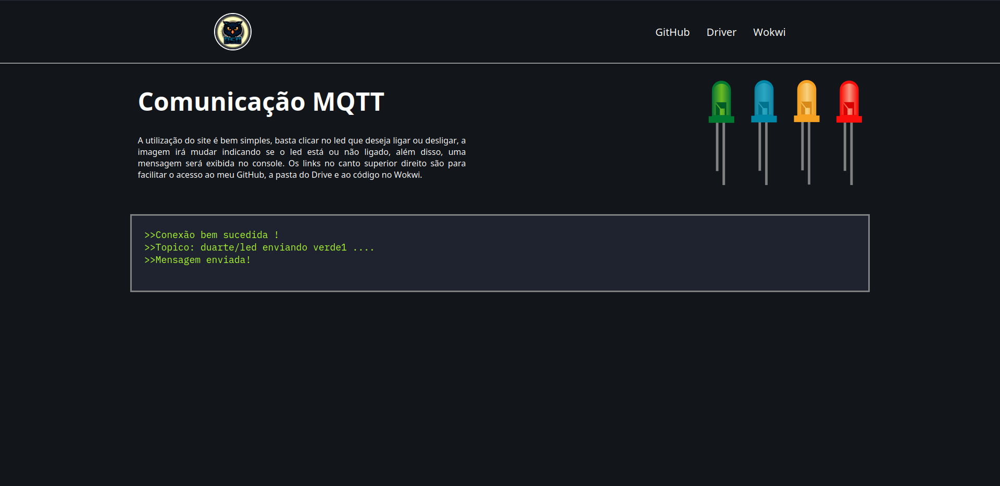
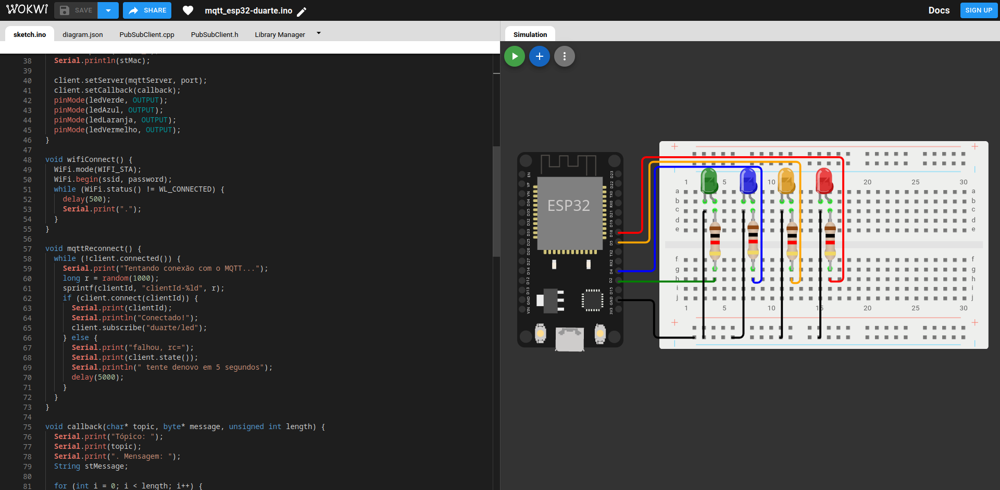
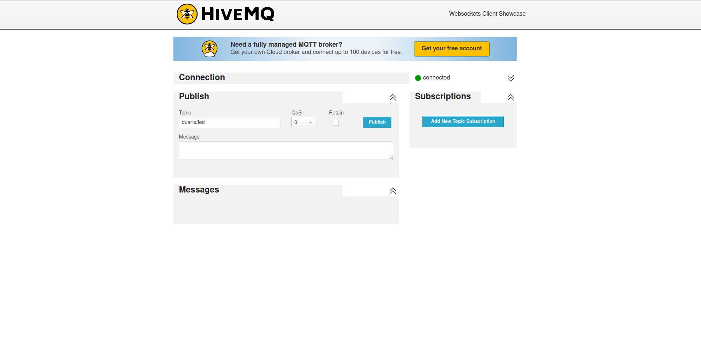

## Sobre o projeto

Resolução de um exercicio da faculdade, o objetivo era escrever um codigo para uma ESP 32 contendo quatro leds, alem disso fazer uma pagina HTML para se comunicar com a ESP 32 para ascender e apagar os leds nela, a comunicação entre a pagina e a ESP 32 é feita atravez do protocolo MQTT, usando o HiveMq.

O codigo é extremamente simples e a usuabilidade tambem, na pagina html existem tres sessoes, o header, o conteudo principal, e o "console".
No header existem tres links sendo eles, repositorio do GitHub, uma pasta no Drive e para o projeto da ESP 32 no Wokwi. Já no conteudo principal tem um breve texto explicando como a pagina funciona e os quatro leds, a seção que eu chamei de console serve para mostrar todo o status de comunicação desde o estado da conexão, mensagens enviadas e o topico para qual a mensagem foi enviada.

## Imagens do projeto

### Pagina HTML

### Projeto Wokwi

### MQTT HiveMq Websocket

