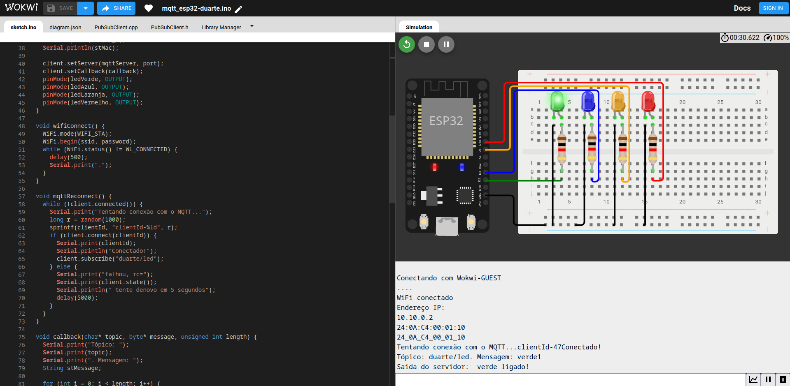

## Sobre o projeto

Resolução de um exercício da faculdade, o objetivo era escrever um código para uma ESP 32 contendo quatro leds, além disso fazer uma página HTML para se comunicar com a ESP 32 para acender e apagar os leds nela, a comunicação entre a página e a ESP 32 é feita através do protocolo MQTT, usando o HiveMq.

O código é extremamente simples e a usabilidade também, na página html existem três sessões, o header, o conteúdo principal, e o "console".
No header existem três links sendo eles, repositório do GitHub, uma pasta no Drive e para o projeto da ESP 32 no Wokwi. Já no conteúdo principal tem um breve texto explicando como a página funciona e os quatro leds, a seção que eu chamei de console serve para mostrar todo o status de comunicação desde o estado da conexão, mensagens enviadas e o tópico para qual a mensagem foi enviada.

## Imagens do projeto

### Pagina HTML

### Projeto Wokwi

### MQTT HiveMq Websocket

